# Comparative genomic analysis of the brown macroalga *Saccharina latissima* (sugar kelp) from the US and EU
Scripts to retrieve, evaluate, compare, and visualize multiple *S. latissima* genome assemblies and related brown macroalgal genomes.

## 1. Pipeline configuration

The analysis is organized by [`genome_analysis_pipeline.sh`](genome_analysis_pipeline.sh). Before running the pipeline, edit the variables near the beginning of the script to match the analysis:

| Variable | Description | Current value |
| --- | --- | --- |
| `scripts_dir` | Directory containing the analysis scripts | `s-latissima-genome-v2` |
| `in_tsv` | Genome metadata table used to locate assemblies and sequencing reads | `s-latissima-genome-v2/genomes_metadata.tsv` |
| `pan_seqFile` | Minigraph-Cactus sequence file | `s-latissima-genome-v2/s_latissima_align1.txt` |
| `prog_seqFile` | Progressive Cactus sequence file | `s-latissima-genome-v2/s_latissima_prog_align.txt` |
| `filt_prog_seqFile` | size-filtered Progressive Cactus sequence file | `s-latissima-genome-v2/s_latissima_prog_align.filt_1000000.txt` |
| `ref_id` | Reference assembly identifier for the pangenome analysis | `corteva_v2` |
| `quer_id` | Query assembly identifier used when extracting a pairwise HAL | `roscoff_v2` |
| `pangenome_dir` | Minigraph-Cactus output directory | `cactus_pangenome_results/01-28-26_6039802` |

### Run the complete pipeline

#### Usage

> sbatch <scripts_dir>/[`genome_analysis_pipeline.sh`](genome_analysis_pipeline.sh) <arg1> <arg2>

#### Example

```bash
sbatch s-latissima-genome-v2/genome_analysis_pipeline.sh run all
```

> **Note:** The two positional arguments are currently used only to satisfy the pipeline's argument-count check. Analysis inputs are set by the variables above.

The pipeline submits each analysis as a separate Slurm job. If a step requires output from an earlier step, wait for that job to finish before submitting the dependent step, or add Slurm job dependencies to the workflow.

## 2. Input data

### Download genome assemblies and sequencing reads

Download the assembly FASTAs and associated sequencing reads listed in the genome metadata table. Files are named using their assembly labels.

#### Usage

> sbatch <scripts_dir>/[`get_data.sbatch`](get_data.sbatch) <scripts_dir>/[\<metadata_file\>](genomes_metadata.tsv)

#### Example

```bash
sbatch s-latissima-genome-v2/get_data.sbatch s-latissima-genome-v2/genomes_metadata.tsv
```

## 3. Gene content and assembly statistics

### Download the BUSCO lineage dataset

The latest versions of relevant [BUSCO](https://busco.ezlab.org) lineages (Stramenopiles, Eukaryota) can be downloaded ahead of time.

#### Usage

> sbatch <scripts_dir>/[`lineage_download.sbatch`](lineage_download.sbatch)

#### Example

```bash
sbatch s-latissima-genome-v2/lineage_download.sbatch
```

### Run BUSCO and QUAST

Run [BUSCO](https://busco.ezlab.org) and [QUAST](https://quast.sourceforge.net) on the assemblies described by `<metadata_file>`.

#### Usage

> sbatch <scripts_dir>/[`eval_genomes.sh`](eval_genomes.sh) <scripts_dir>/[\<metadata_file\>](genomes_metadata.tsv) <scripts_dir>/[`busco.sbatch`](busco.sbatch) <scripts_dir>/[`quast.sbatch`](quast.sbatch)

#### Example

```bash
sbatch s-latissima-genome-v2/eval_genomes.sh s-latissima-genome-v2/genomes_metadata.tsv s-latissima-genome-v2/busco.sbatch s-latissima-genome-v2/quast.sbatch
```

### Summarize and visualize BUSCO results

Generate BUSCO summary files and comparative plots after the BUSCO jobs have completed.

#### Usage

> sbatch <scripts_dir>/[`eval_genomes.sh`](eval_genomes.sh) <scripts_dir>/[\<metadata_file\>](genomes_metadata.tsv) <scripts_dir>/[`busco_compare.sbatch`](busco_compare.sbatch)

#### Example

```bash
sbatch s-latissima-genome-v2/eval_genomes.sh s-latissima-genome-v2/genomes_metadata.tsv s-latissima-genome-v2/busco_compare.sbatch
```

#### Results

##### Stramenopiles BUSCO
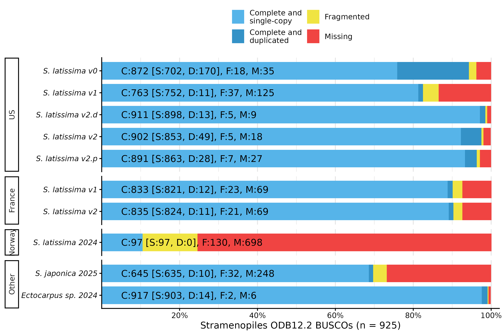

##### Eukaryota BUSCO
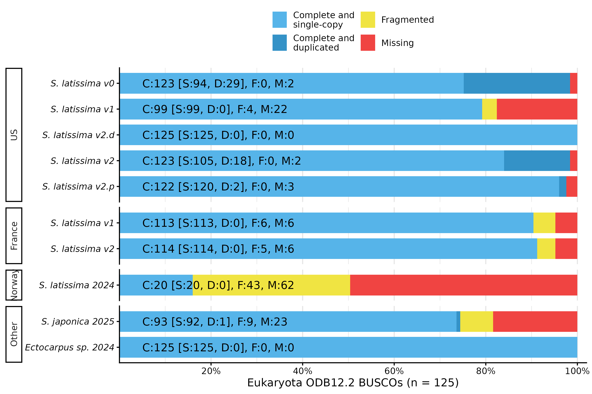

### Evaluation of assembly composition

Assembly-length and scaffold-contiguity visualization with [`scaffold_eval.R`](scaffold_eval.R) is planned but is not yet called by the pipeline.

#### Results

##### Comparisons of chromosome and contig lengths across all compared species, highlighting assembly statistics

Violin plot of length distribution per assembly
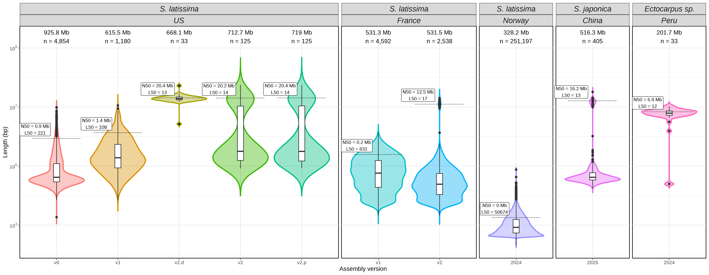

Bar plot of length distribution per assembly, marking set length cutoff (default > 1Mb)
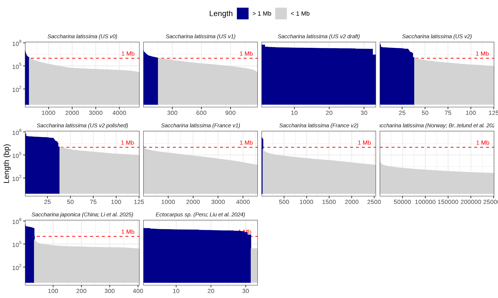

Bar plot of length distribution per assembly, marking n50 cutoff
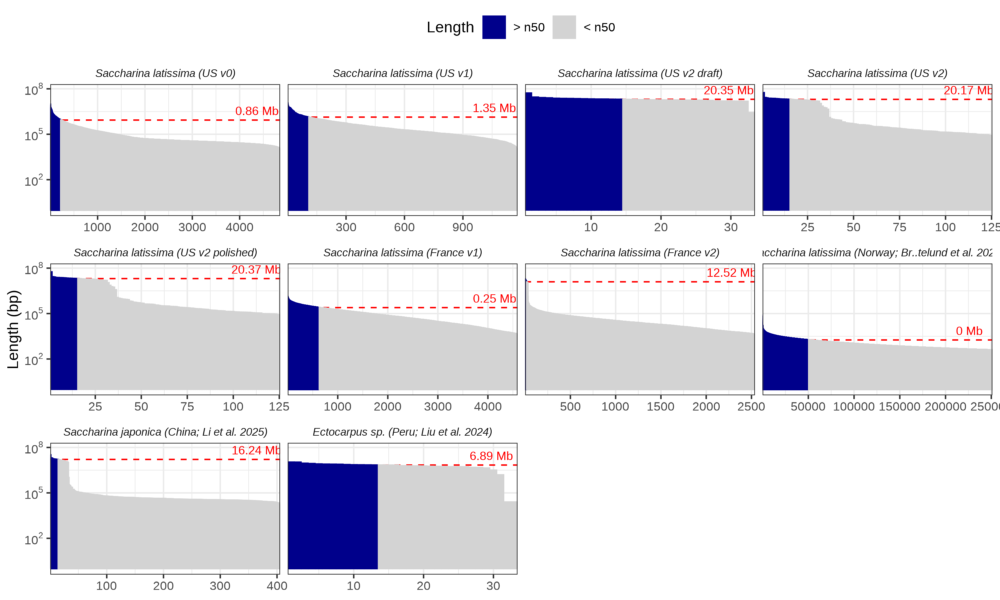

##### Comparison of chromosome and contig lengths between US and France *S. latissima* v2 assemblies
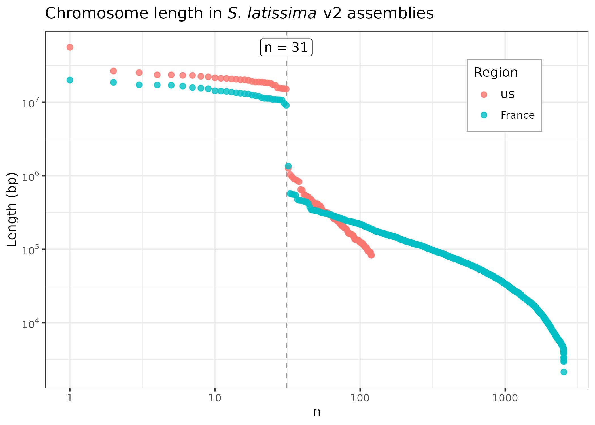

##### Impact of polishing on chromosome and contig lengths in US *S. latissima* v2 assembly
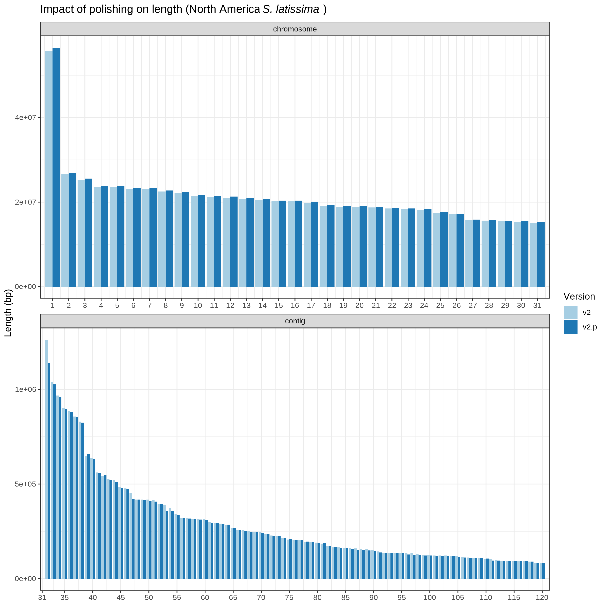


## 4. Cactus installation

Install and test [Cactus](https://github.com/ComparativeGenomicsToolkit/cactus) in a Conda environment before running either pangenome or progressive whole-genome alignment workflow.

#### Usage

> sbatch <scripts_dir>/[`cactus_install_conda.sh`](cactus_install_conda.sh)

#### Example

```bash
sbatch s-latissima-genome-v2/cactus_install_conda.sh
```

## 5. Pangenome alignment with Minigraph-Cactus

### Run Minigraph-Cactus alignment

Use [Minigraph-Cactus](https://github.com/ComparativeGenomicsToolkit/cactus/blob/master/doc/pangenome.md) to construct a reference-based pangenome using the assemblies in [`<pan_seqFile>`](s_latissima_align1.txt) and the specified reference assembly identifier.

#### Usage

> sbatch <scripts_dir>/[`cactus_pangenome.sbatch`](cactus_pangenome.sbatch) <scripts_dir>/[\<pan_seqFile\>](s_latissima_align1.txt) <reference_id>

#### Example

```bash
sbatch s-latissima-genome-v2/cactus_pangenome.sbatch s_latissima_align1.txt corteva_v2
```

### Extract a pairwise HAL alignment

Extract a [HAL](http://github.com/glennhickey/hal) alignment for a reference-query assembly pair from the pangenome PAF output.

#### Usage

> sbatch <scripts_dir>/[`hal_extract.sbatch`](hal_extract.sbatch) <pangenome_dir> <reference_id> <query_id>

#### Example

```bash
sbatch s-latissima-genome-v2/hal_extract.sbatch cactus_pangenome_01-28-26_6039802 corteva_v2 roscoff_v2
```

### Generate pangenome plots

#### Usage

> sbatch <scripts_dir>/[`pangenome_plots.sbatch`](pangenome_plots.sbatch)

#### Example

```bash
sbatch s-latissima-genome-v2/pangenome_plots.sbatch
```

#### Results

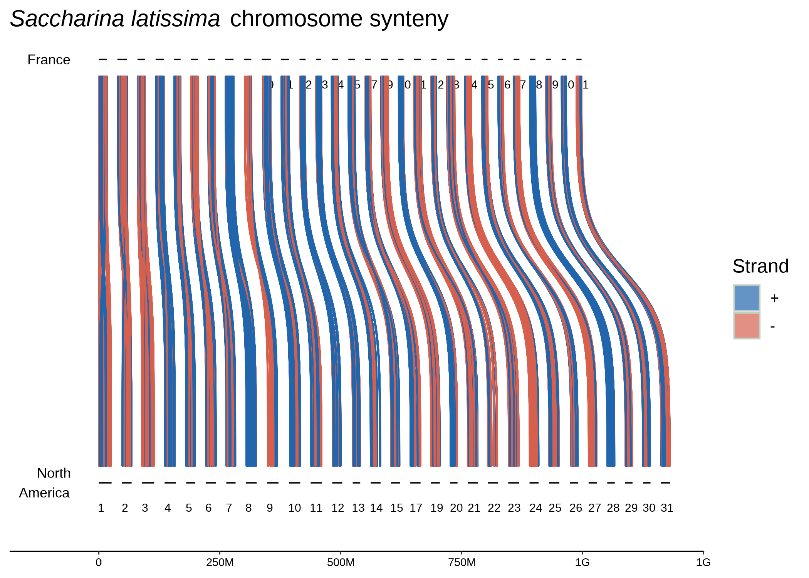

### Visualize per-chromosome pangenome graphs with ODGI

Generate per-chromosome graph visualizations with [ODGI](https://github.com/pangenome/odgi).

#### Usage

> sbatch <scripts_dir>/[`odgi_viz.sbatch`](odgi_viz.sbatch) <scripts_dir>/[\<pan_seqFile\>](s_latissima_align1.txt) <pangenome_dir>

#### Example

```bash
sbatch s-latissima-genome-v2/odgi_viz.sbatch s-latissima-genome-v2/s_latissima_align1.txt cactus_pangenome_01-28-26_6039802
```

### Visualize the pangenome with ntSynt-viz

Generate a pangenome graph with [ntSynt-viz](https://github.com/bcgsc/ntSynt-viz).

#### Usage

> sbatch <scripts_dir>/[`ntSynt_viz.sbatch`](ntSynt_viz.sbatch) <scripts_dir>/[\<pan_seqFile\>](s_latissima_align1.txt) <pangenome_dir>

#### Example

```bash
sbatch s-latissima-genome-v2/ntSynt_viz.sbatch s-latissima-genome-v2/s_latissima_align1.txt cactus_pangenome_results/01-28-26_6039802
```

## 6. Multi-species whole-genome alignment with Progressive Cactus

### Generate Cactus guide tree

Create a guide tree for the genomes listed in the [Progressive Cactus](https://github.com/ComparativeGenomicsToolkit/cactus/blob/master/doc/progressive.md) sequence file [`<prog_seqFile>`](s_latissima_prog_align.txt).

#### Usage

> sbatch <scripts_dir>/[`make_guide_tree.sbatch`](make_guide_tree.sbatch) <scripts_dir>/[\<prog_seqFile\>](s_latissima_prog_align.txt)

#### Example

```bash
sbatch s-latissima-genome-v2/make_guide_tree.sbatch s-latissima-genome-v2/s_latissima_prog_align.txt
```

#### Results

##### Distribution of orthologs with unique sequence in orthogroups conserved across all compared species
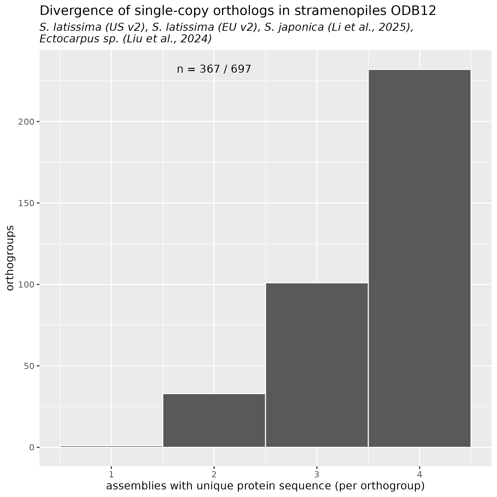

##### Neighbor-joining (NJ) and Maximum-likelihood (ML) trees built from BUSCO predicted protein alignments
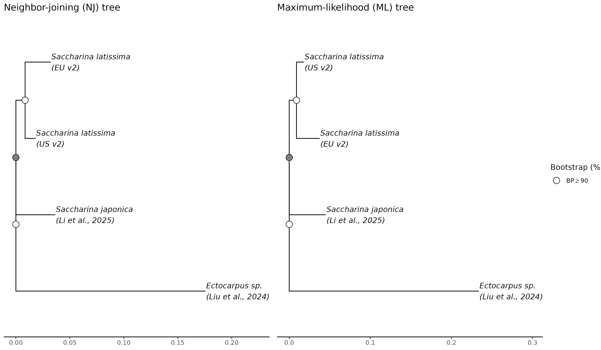

##### Maximum-likelihood (ML) tree showing BUSCO predicted protein alignments
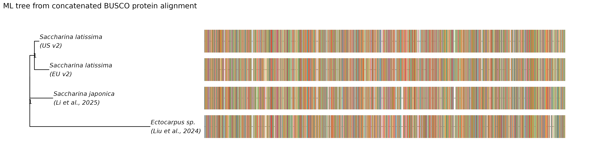

### Filter assemblies by contig length

Filter each assembly before alignment.
The pipeline currently retains contigs at least 1 Mb (`<minlen>`) in length.
Outputs a filtered Cactus sequence file, [`<filt_prog_seqFile>`](s_latissima_prog_align.filt_1000000.txt), named with the convention: `<prog_seqFile>.filt_<minlen>.txt`.

#### Usage

> sbatch <scripts_dir>/[`filter_assemblies.sbatch`](filter_assemblies.sbatch) <scripts_dir>/[\<prog_seqFile\>](s_latissima_prog_align.txt) <minlen>

#### Example

```bash
sbatch s-latissima-genome-v2/filter_assemblies.sbatch s-latissima-genome-v2/s_latissima_prog_align.txt 1000000
```

### Run Progressive Cactus alignment

#### Usage

> sbatch <scripts_dir>/[`prog_cactus.sbatch`](prog_cactus.sbatch) <scripts_dir>/[\<seqFile\>](s_latissima_prog_align.txt)

#### Example

```bash
sbatch s-latissima-genome-v2/prog_cactus.sbatch s-latissima-genome-v2/s_latissima_prog_align.txt
```

### Visualize the HAL alignment

Visualize the HAL output generated by Progressive Cactus.

#### Usage

> sbatch <scripts_dir>/[`hal_visualize.sbatch`](hal_visualize.sbatch)

#### Example

```bash
sbatch s-latissima-genome-v2/hal_visualize.sbatch
```

> **Note:** `hal_visualize.sbatch` is still in development.
